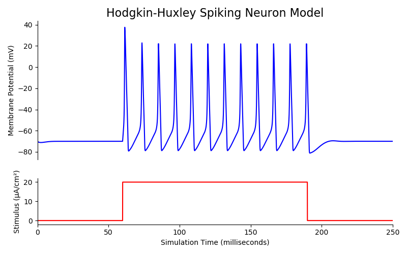
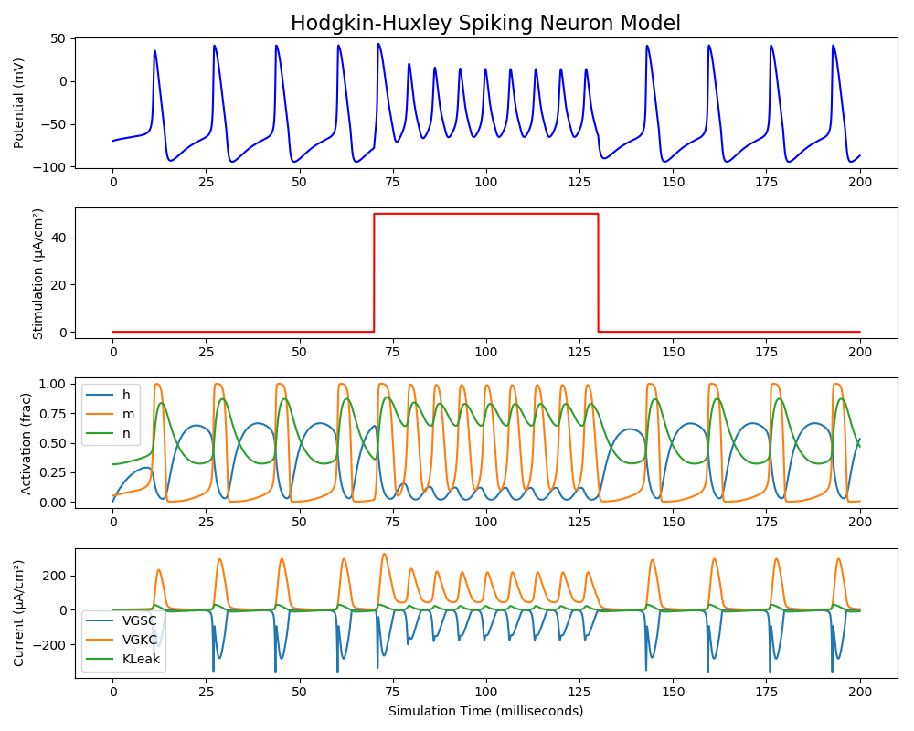

# pyHH
**pyHH is a simple Python implementation of the Hodgkin-Huxley spiking neuron model.** While many implementations of this model exist online, pyHH strives to be the simplest to understand (and port to other languages). pyHH simulates conductances and calculates membrane voltage at discrete time points so it does not require a differential equation solver. [HHSharp](https://github.com/swharden/HHSharp) is a similar project written in C#.



## Minimal Code Example
A full Hodgkin-Huxley spiking neuron model and simulation was created in fewer than 100 lines of Python ([dev/concept4.py](dev/concept4.py)). Unlike other code examples on the internet, this implementation is object-oriented and Pythonic. When run, it produces the image above.

## Python Package
The `pyhh` package includes Hodgkin-Huxley models and tools to organize simulation data. Start by creating a `HHModel` cell, customize it as desired, then feed it into a simulation. Optional arguments control the simulation length and spatial resolution.

```python
import pyhh
import numpy as np

# customize a neuron model
model = pyhh.HHModel()
model.gNa = 100 # typically 120
model.gK = 5 # typically 36
model.EK = -35 # typically -12

# customize a stimulus waveform
stim = np.zeros(2000)
stim[700:1300] = 50 # add a square pulse

# run a simulation on the model
sim = pyhh.Simulation(model)
sim.Run(stimulusCurrent=stim)
```

After the simulation runs the results are stored as properties of the `Simulation` object ready to plot with a plotting library like Matplotlib:

```python
import matplotlib.pyplot as plt

plt.figure(figsize=(10, 6))

ax1 = plt.subplot(311)
ax1.plot(sim.times, sim.Vm - 70, color='b')
ax1.set_ylabel("Membrane Potential (mV)")
ax1.set_title("Hodgkin-Huxley Spiking Neuron Model", fontSize=16)

ax2 = plt.subplot(312)
ax2.plot(sim.times, stim, color='r')
ax2.set_ylabel("Stimulation")

ax3 = plt.subplot(313, sharex=ax1)
ax3.plot(sim.times, sim.StateH, label='h')
ax3.plot(sim.times, sim.StateM, label='m')
ax3.plot(sim.times, sim.StateN, label='n')
ax3.set_ylabel("Open State")
ax3.set_xlabel("Simulation Time (milliseconds)")
ax3.legend()

plt.tight_layout()
plt.savefig("tests/demo.png")
plt.show()
```



## Theory

### Hodgkin–Huxley model
The Hodgkin–Huxley model, or conductance-based model, is a mathematical model that describes how action potentials in neurons are initiated and propagated. 


Hodgkin–Huxley type models represent the biophysical characteristic of cell membranes. The lipid bilayer is represented as a capacitance (`Cm`). Voltage-gated and leak ion channels are represented by nonlinear (`gn`) and linear (`gL`) conductances, respectively. 

The electrochemical gradients driving the flow of ions are represented by batteries (`E`), and ion pumps and exchangers are represented by current sources (`Ip`).

### Additional Resources
* [Hodgkin and Huxley, 1952](https://www.ncbi.nlm.nih.gov/pmc/articles/PMC1392413/pdf/jphysiol01442-0106.pdf) (the original manuscript)
* [The Hodgkin-Huxley Mode](http://www.genesis-sim.org/GENESIS/iBoG/iBoGpdf/chapt4.pdf) (The GENESIS Simulator, Chapter 4)
* Wikipedia: [Hodgkin–Huxley model](https://en.wikipedia.org/wiki/Hodgkin%E2%80%93Huxley_model)
* [Hodgkin-Huxley spiking neuron model in Python](https://www.bonaccorso.eu/2017/08/19/hodgkin-huxley-spiking-neuron-model-python/) by Giuseppe Bonaccorso - a HH model which uses the [`scipy.integrate.odeint` ordinary differential equation solver](https://docs.scipy.org/doc/scipy/reference/generated/scipy.integrate.odeint.html)
* [Introduction to Computational Modeling: Hodgkin-Huxley Model](http://andysbrainblog.blogspot.com/2013/10/introduction-to-computational-modeling.html) by Andrew Jahn - a commentary of the HH model with matlab code which discretely simulates conductances
* [NeuroML Hodgkin Huxley Tutorials](https://github.com/swharden/hodgkin_huxley_tutorial)
